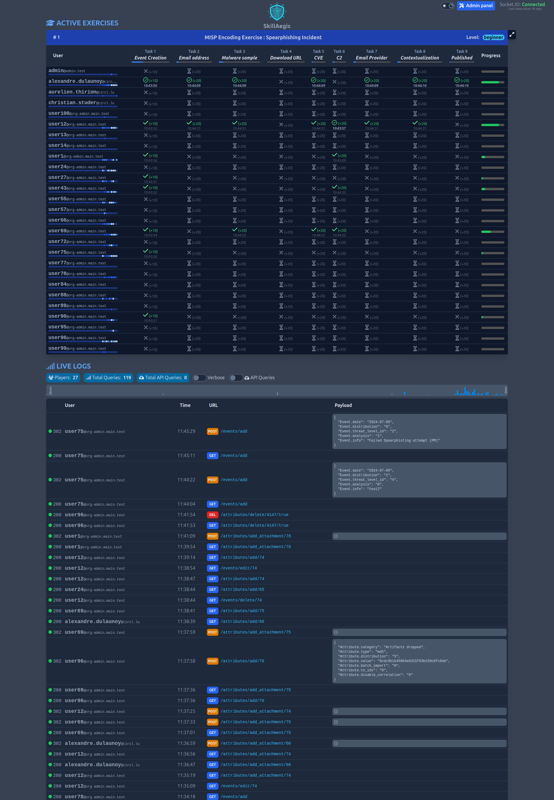
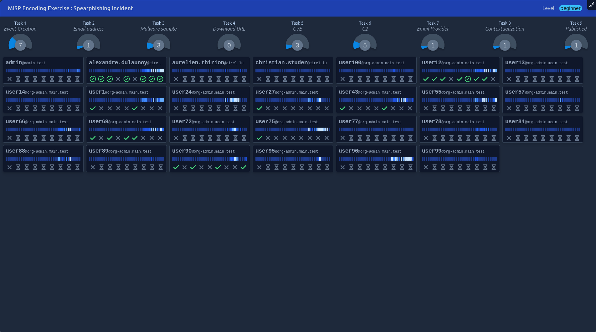

# SkillAegis-Dashboard
 

**SkillAegis-Dashboard** is a platform to run a training session and visualize the progress of participants in real-time.

The Dashboard allows you to deploy and run scenarios under the [Common Exercise Format (CEXF)](https://misp.github.io/cexf/) that can are designed by other application such as **[SkillAegis Editor](https://github.com/MISP/SkillAegis-Editor)**.

> [!NOTE]  
> Consider running this application with **[SkillAegis](https://github.com/MISP/SkillAegis)** for Production.


*Short demo of SkillAegis-Dashboard: Once the application starts, the user selects an exercise. From that point, the application tracks the real-time progression of each players.*


*On the dashboard main page, you can monitor the progress of all participants for the selected exercise and view real-time logs of their activity feed.*


*The fullscreen view provides an overview of the status of all users in a single, easily accessible display.*


## Installation

To get started with SkillAegis-Editor, follow these steps:

1. Install dependencies
   ```bash
   python3 -m venv venv
   source venv/bin/activate
   pip3 install -r requirements.txt
   ```
2. Clone the configuration file
    ```bash
    cp config.py.sample config.py
    ```
    - [optional] Update the configuration
3. Start the application
   ```bash
   # Usage: ./start.sh --exercise_folder <folder> [--host <host>] [--port <port>]
   ./start.sh --exercise_folder scenarios/
   ```

## Development

### Back-end
```bash
source venv/bin/activate
fastapi dev main.py
```

### Front-end

#### Project Setup

```sh
npm install
```

#### Compile and Hot-Reload for Development

```sh
npm run dev
```

#### Compile and Minify for Production

```sh
npm run build
```

#### Lint with [ESLint](https://eslint.org/)

```sh
npm run lint
```


## Installation
```bash
# Setup venv
python3 -m venv venv
source venv/bin/activate

# Install deps
pip3 install -r REQUIREMENTS

# Create config file and adapt it to your needs
cp config.py.sample config.py
```

## Running the PROD setup
```bash
python3 server.py
# Access the page http://localhost:4000 with your browser
```


## Running the DEV setup
```bash
python3 server.py
```
```bash
npm run dev
# Access the page provided by the output of the above command
```
## Project Setup

```sh
npm install
```

### Compile and Hot-Reload for Development

```sh
npm run dev
```

### Compile and Minify for Production

```sh
npm run build
```

### Lint with [ESLint](https://eslint.org/)

```sh
npm run lint
```
